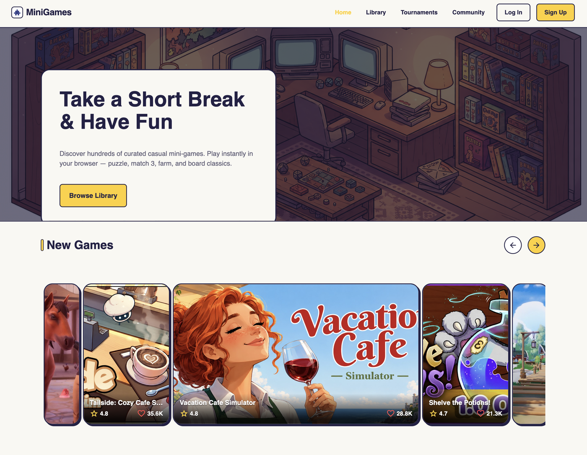
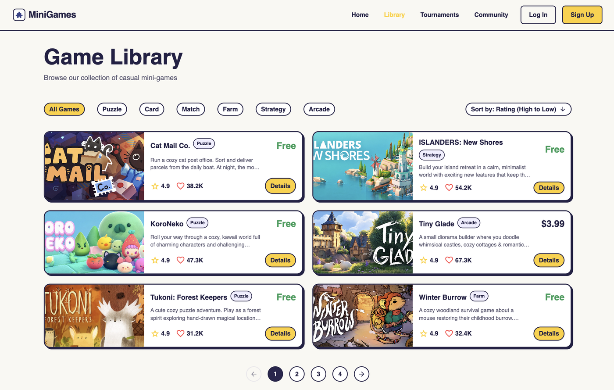
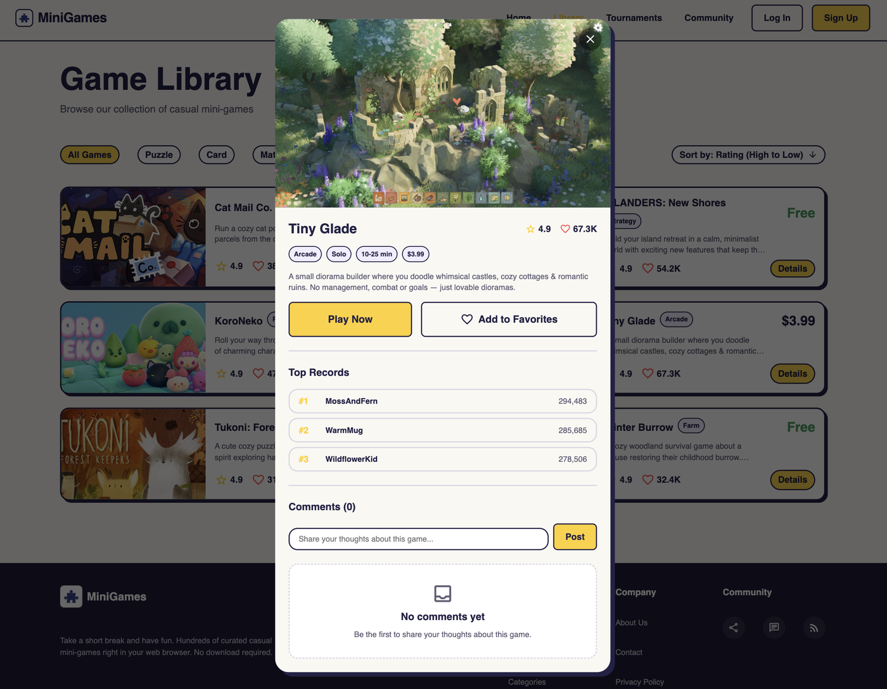
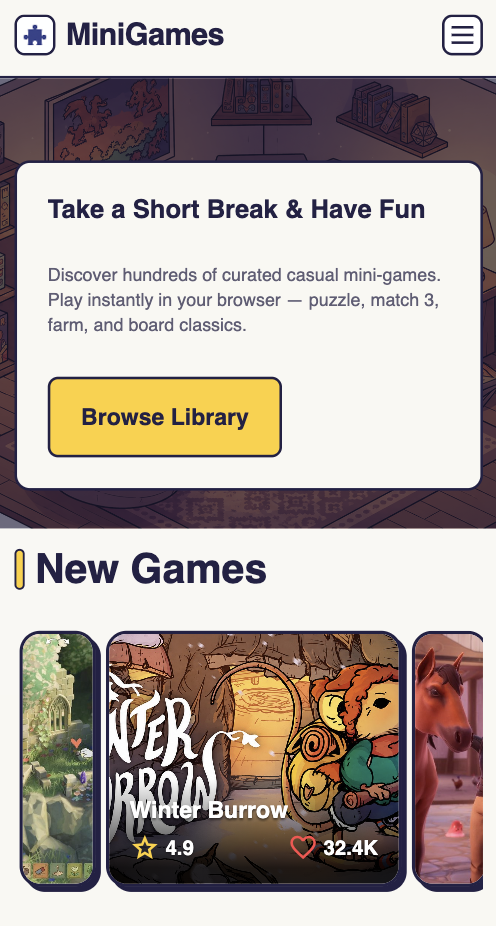

# MiniGames

Каталог казуальных мини-игр — учебный проект квалификационного этапа [RS School](https://rs.school/) (Stories 1–3).

**Демо:** https://katymist.github.io/MiniGames-Story-1/

Одностраничное приложение (SPA) на чистом TypeScript без фреймворков: главная страница с каруселью новых игр и таблицей лидеров, библиотека игр с фильтрами, сортировкой и пагинацией, диалоги Game Details и авторизации. Все данные загружаются с REST API, вёрстка адаптивная (375 / 768 / 1440 / 1920 px) и сделана по макету Figma.

## Скриншоты

| Главная                                        | Библиотека                                      |
| ---------------------------------------------- | ----------------------------------------------- |
|  |  |

| Game Details                                              | Мобильная версия                                 |
| --------------------------------------------------------- | ------------------------------------------------ |
|  |  |

## Возможности

- **Главная:** карусель новых игр (свайп, автопрокрутка, бесконечная лента) и таблица «Top Players This Week» — данные из API.
- **Библиотека:** карточки игр по 6 на странице; фильтр по категориям, сортировка по рейтингу и названию, пагинация — всё выполняется на сервере.
- **Game Details:** описание, характеристики, рекорды игроков и последние комментарии с относительным временем («2 hours ago»).
- **Авторизация:** диалог входа и регистрации с валидацией форм (сами запросы авторизации — в Story 4).
- **Роутинг:** собственный роутер на History API. URL — единственный источник правды: страница, фильтры, пагинация и открытые диалоги восстанавливаются по ссылке и работают кнопки «Назад»/«Вперёд».
  - `/`, `/home` — главная, `/library` — библиотека, любой другой путь — страница 404;
  - `/library?category=puzzle&sort=rating-desc&page=2` — фильтры и пагинация;
  - `?game=<slug>` — Game Details, `?auth=login` / `?auth=register` — авторизация.
- **Состояния загрузки:** скелетоны, баннеры ошибок с повтором запроса, заглушки «Data Not Found» и Snackbar-уведомления во всех секциях.

## API

[MiniGames REST API](https://faxb76kxra.execute-api.eu-central-1.amazonaws.com/docs) (`src/shared/api.ts`):

- `GET /api/games?featured=true` — карусель на главной;
- `GET /api/games?category=…&sort=…&page=…&limit=6` — библиотека;
- `GET /api/categories` — категории фильтра;
- `GET /api/leaderboard` — таблица лидеров;
- `GET /api/games/{slug}` и `GET /api/games/{slug}/comments?limit=3&sort=newest` — Game Details.

Картинки игр берутся по путям из API (`cardImage`, `heroImage`) и лежат в `public/assets/images/games`.

## Стек

- TypeScript (без фреймворков и UI-библиотек)
- Vite
- Sass (дизайн-токены, миксины брейкпоинтов)
- ESLint + Prettier, Husky + commitlint
- GitHub Actions + GitHub Pages (деплой)

## Структура

```
src/
  app/         роутер и навигация (History API)
  components/  компоненты страниц и диалогов
  shared/      API-клиент, форматирование, общие данные
  styles/      токены, миксины, базовые стили
public/        статика (favicon, картинки игр)
```

## Запуск

```bash
npm install
npm run dev
```

Приложение откроется по адресу, который выведет Vite (обычно `http://localhost:5173`).

## Скрипты

- `npm run dev` — запуск в режиме разработки
- `npm run build` — сборка для продакшена (папка `dist`)
- `npm run preview` — просмотр собранной версии
- `npm run lint` — проверка ESLint
- `npm run format` — форматирование Prettier

## Автор

[@KatyMist](https://github.com/KatyMist)
